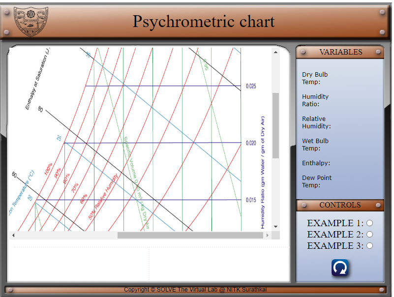
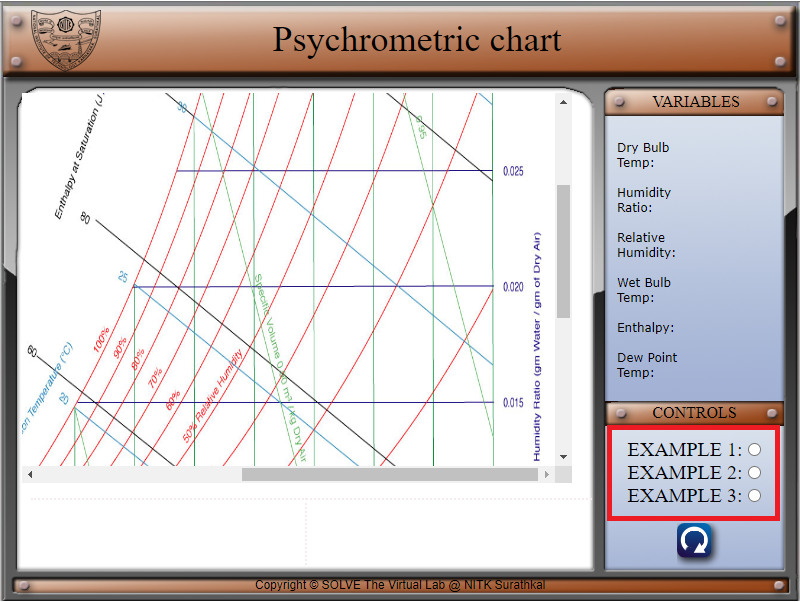
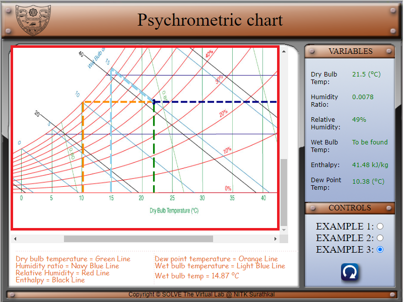
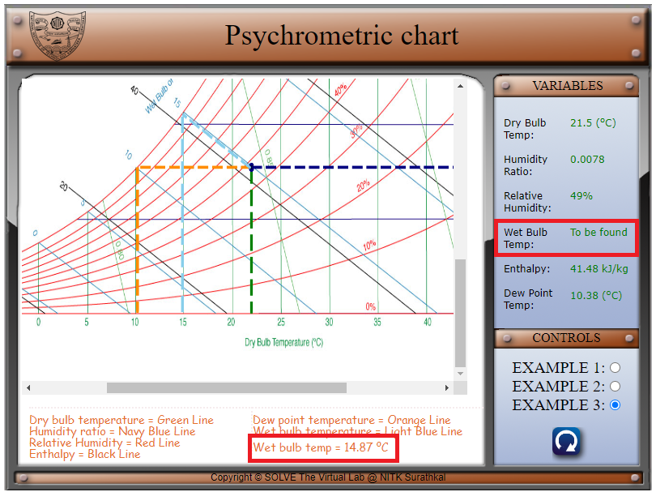
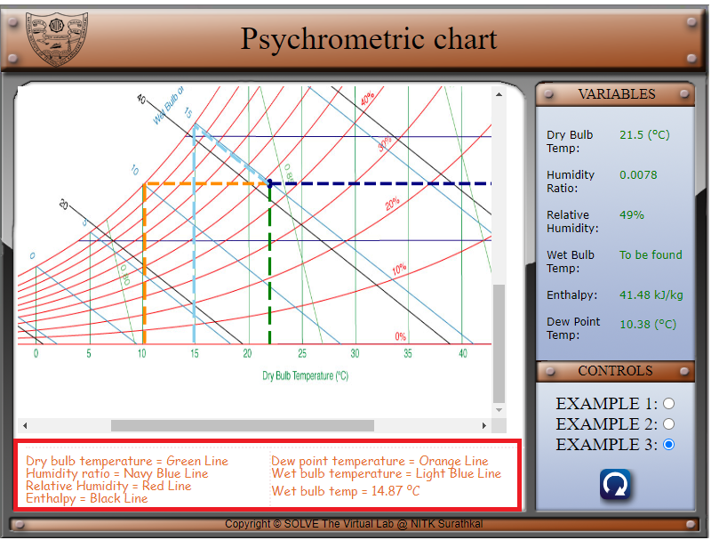

#### These procedure steps will be followed on the simulator

1. In the simulation window, the psychrometric chart is available. 

 

2. There are three example psychrometric chart problems that can be chosen using the radio buttons in the control tab. 

 

3. Once an example is chosen, the various properties are marked on the psychrometric chart. 

 

4. The property values are also listed in the variables tab for each example. 

 

5. One of the properties is to be calculated by the user. The answer is listed in the bottom box. 

 

6. The legend for the various coloured lines is represented in the box below.

 
