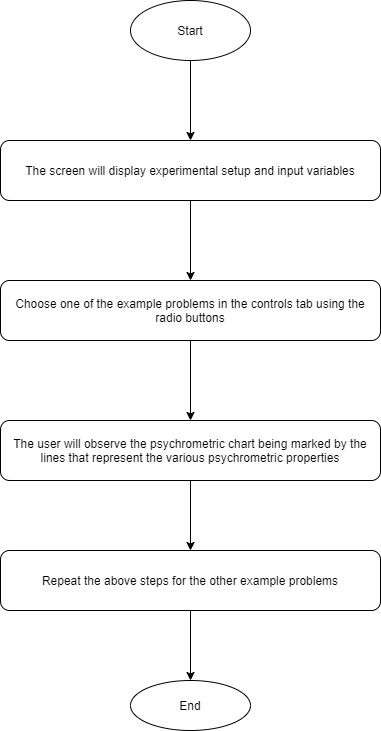
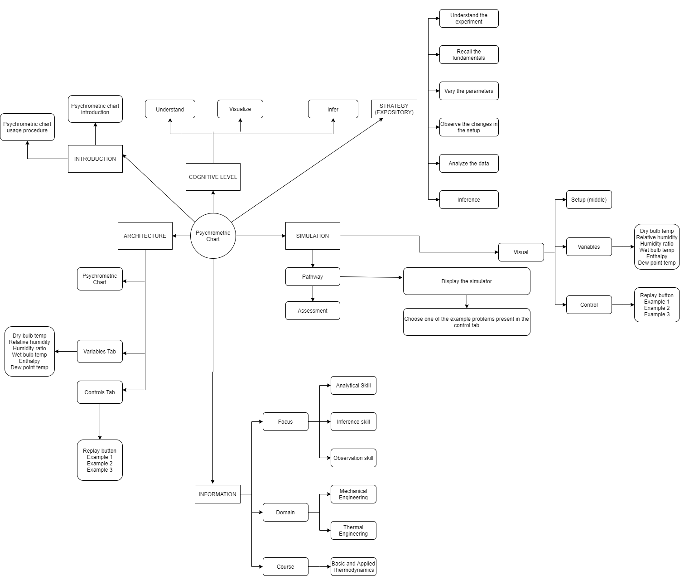
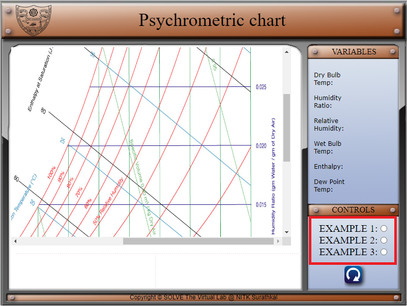
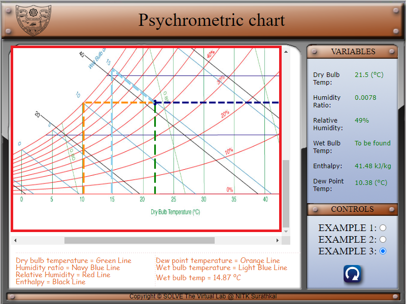
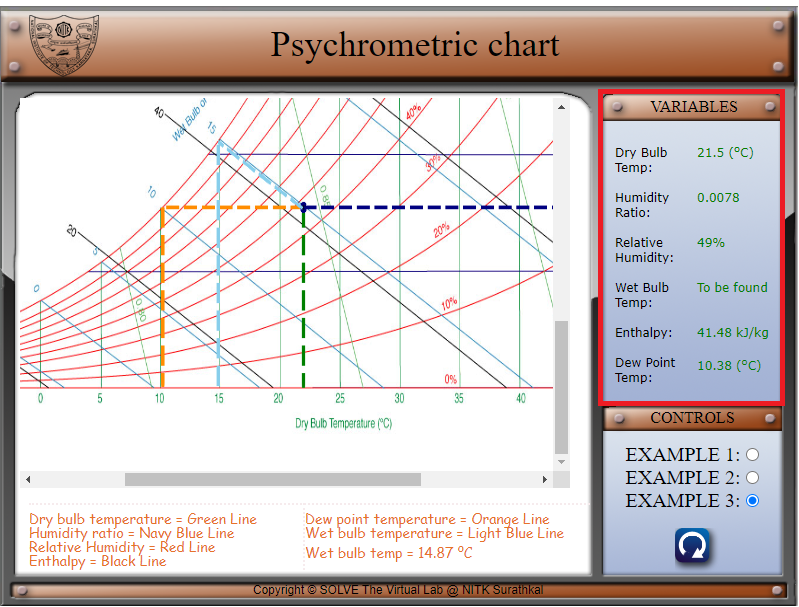
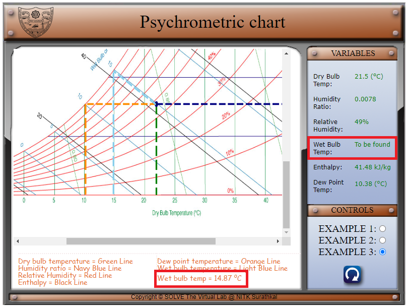
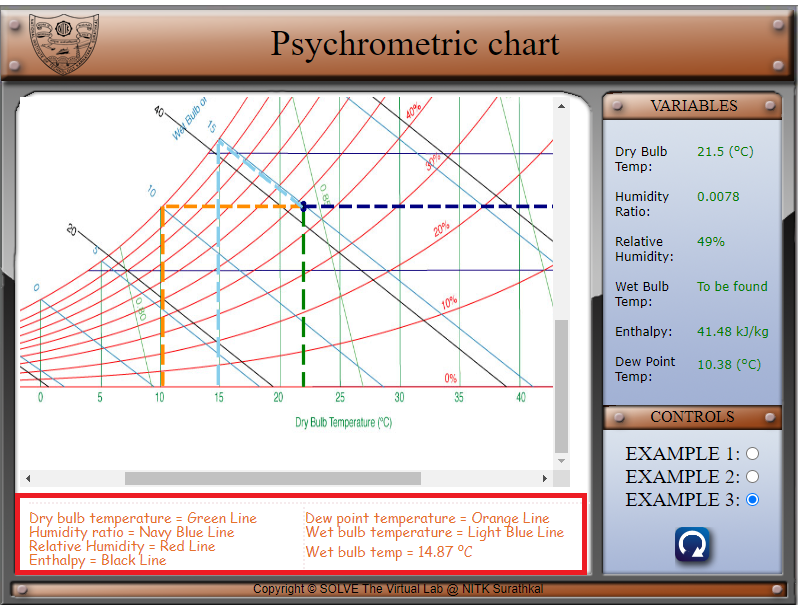
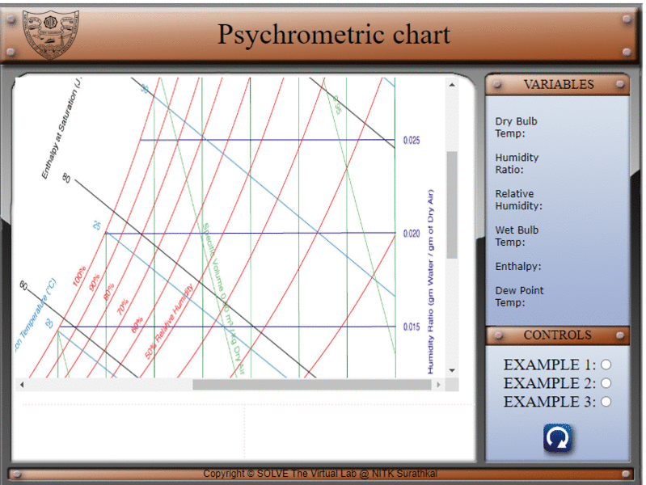

## Storyboard (Round 2)

Experiment: Psychrometric Chart

**1. Story Outline**:

A psychrometric chart is a complex graph that is used to assess the physical and thermodynamic properties of gas-vapour mixtures at constant pressure. It is often used to assess the properties of moist air. 

There are six important psychrometric properties that can be determined with the help of the chart:

1. Dry bulb temperature: A measure of air temperature recorded by a thermometer exposed to the air but shielded from moisture and radiation. 
2. Wet bulb temperature: The temperature recorded by a thermometer that has its bulb wrapped in cloth and moistened with distilled water. 
3. Relative humidity: The ratio of the actual vapour pressure relative to the vapour pressure of saturated air at the same temperature, expressed as a percentage. 
4. Dew point temperature: The highest temperature at which water vapour will condense. 
5. Humidity ratio: The dry-basis moisture content of air expressed as the weight of water vapour per unit weight of dry air.
6. Enthalpy: The energy content of the air. 

The properties determined by the psychrometric chart can be used in heating, ventilation and air conditioning applications among others. 

This experiment is a demonstration of how to read the psychrometric chart to determine the above six properties.

 **2. Story**:

  **2.1 Set the visual stage description**:

  The experiment consists of a psychrometric chart. All the buttons and the parameters control the right edge of the frame. The variable panel contains the psychrometric properties i.e. the dry bulb temperature, wet bulb temperature, relative humidity, dew point temperature, humidity ratio and enthalpy. These values are empty at the onset of the experiment.

  There are three preset examples in the controls box of the experiment. When one of the examples is chosen, the values corresponding to that example are displayed against the six psychometric properties.

  Displayed on the canvas is the psychrometric chart. The chart can be scrolled with the help of the horizontal and vertical scroll bars or using a mouse.

  **2.2 Set User Objectives & Goals**:

  1. Understand the various psychrometric properties that can be determined by the graph.

  2. Portray the various psychometric properties on the graph.

  3. Calculate the remaining psychrometric properties.

  4. Infer the conditions of the moist air from the properties.

  **2.3 Set the pathway activities**:

  Displayed on the canvas is the psychrometric chart. The chart can be scrolled with the help of the horizontal and vertical scroll bars or using a mouse.

  The initial values of the six psychrometric properties are empty.

  There are three preset examples to choose from.

  1. The first example has the following values: 
  Dry bulb temperature: 19.5℃ 
  Humidity ratio: 0.009 
  Relative humidity: 70% 
  Wet bulb temperature: 15.99℃ 
  Enthalpy: 44.7 kJ/kg 
  Dew point temperature: 13.9℃ 

  2. The second example has the following values: 
  Dry bulb temperature: 29℃ 
  Humidity ratio: 0.0022 
  Relative humidity: 9% 
  Wet bulb temperature: 12.44℃ 
  Enthalpy: 34.85 kJ/kg 
  Dew point temperature: -6.25℃ 

  3. The third example has the following values: 
  Dry bulb temperature: 21.5℃ 
  Humidity ratio: 0.0078 
  Relative humidity: 49% 
  Wet bulb temperature: 14.87℃ 
  Enthalpy: 41.48 kJ/kg 
  Dew point temperature: 10.38℃ 

  Choose an example to visualize how the properties are determined using the chart. 
  Calculate the remaining psychrometric property.

  **2.4 Set Challenges and Questions/Complexity/variation**

  **2.4.a Questions before simulation**:

  1. Psychrometry is the study of the properties of:

    <ol type="a">
   <li>Dry air</li>
   <li>A mixture of air and water vapour</li>
   <li>Ideal gas</li>
   <li>None of the above</li>
   </ol>

   Answer: b

  2. A mixture of various gases that constitute air and water is known as:

  <ol type="a">
  <li>Ideal air</li>
  <li>Natural air</li>
  <li>Moist air</li>
  <li>Normal air</li>
  </ol>

  Answer: c

  3. When there is a neutral equilibrium between the moist air and the liquid or solid phases of water, the air is known as:

  <ol type="a">
  <li>Saturated air</li>
  <li>Supersaturated air</li>
  <li>Desiccated air</li>
  <li>None of the above</li>
  </ol>

  Answer: a

  4. The saturation curve in a psychrometric chart is the curve at:

   <ol type="a">
  <li>0% relative humidity</li>
  <li>Humidity ratio 0</li>
  <li>Humidity ratio 1</li>
  <li>100% relative humidity</li>
  </ol>

  Answer: d

**2.4.b Questions after simulation**

5. At a relative humidity of 70% which of the following is true?

<ol type="a">
<li> Dew point temperature is less than the wet bulb temperature.</li>
<li> Dry bulb temperature is less than the dew point temperature.</li>
<li> Wet bulb temperature is more than dry bulb temperature.</li>
<li> The dew point temperature and the wet bulb temperature are equal.</li>
</ol>
Answer: a

6. If the wet bulb temperature is 15℃ and the relative humidity is 50%, find the humidity ratio of the air.

<ol type="a">
<li> 0.010</li>
<li> 0.008</li>
<li> 0.005</li>
<li> 0.003</li>
</ol>

Answer: b

7. If the dry bulb temperature is 37℃ and the relative humidity is 50%, find the enthalpy of the air.

<ol type="a">
<li>88.31 kJ/kg dry air</li>
<li>65.24 kJ/kg dry air</li>
<li>43.56 kJ/kg dry air</li>
<li>22.98 kJ/kg dry air</li>
</ol>

Answer: a

8. If the wet bulb temperature is 15℃ and the relative humidity is 50%, find the dew point temperature of the air.

<ol type="a">
<li>5℃</li>
<li>10℃</li>
<li>15℃</li>
<li>20℃</li>

Answer: b

**2.5 Allow pitfalls: NA**

**2.6 Conclusion**:

The time required to perform the virtual experiment:

The approximate time required to understand the procedure and the various properties to be found is 5 mins. The approximate time required to execute and understand each of the 3 examples problems is 5 mins. Therefore, the total time required to perform the experiment is about 20 minutes.

<!-- # Below are the examples added for reference.
# To get mathematical equatios in html format: go to link: https://www.codecogs.com/latex/eqneditor.php and download equations in png format
# In the same link you have option to download equation as punching

### using png -->
<!--
//markdown syntax -->

<!-- //html syntax

 -->

**3. Flowchart**:

**4. Mindmap**:

**5. storyboard**:

1. In the simulation window, the psychrometric chart is available. 

 

2. There are three example psychrometric chart problems that can be chosen using the radio buttons in the control tab. 

 

3. Once an example is chosen, the various properties are marked on the psychrometric chart. 

 

4. The property values are also listed in the variables tab for each example. 

 

5. One of the properties is to be calculated by the user. The answer is listed in the bottom box. 

 

6. The legend for the various coloured lines is represented in the box below.

 

**6. References**:

Basic and Applied Thermodynamics - P.K. Nag
Thermodynamics: An Engineering Approach - Yunus A Cengel, Michael A Boles
